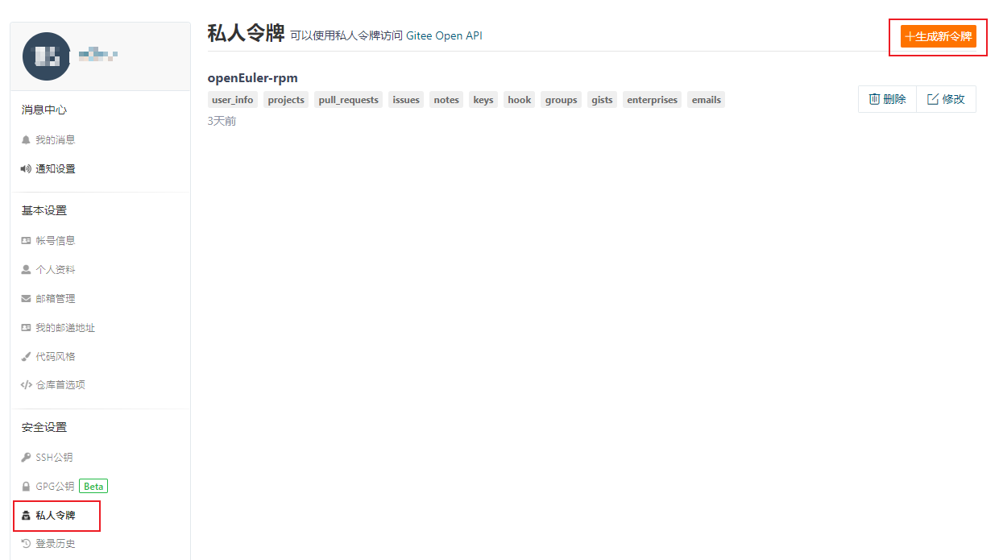
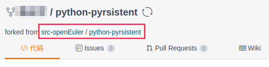
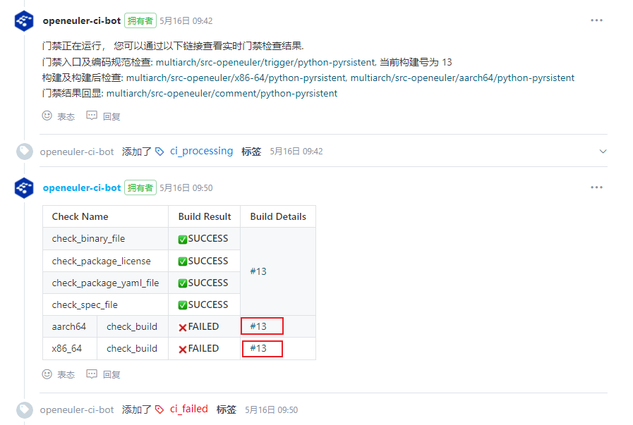
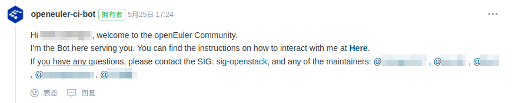
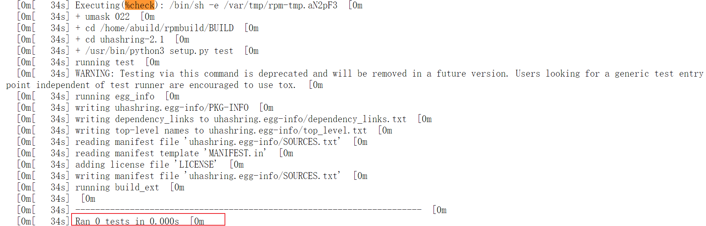

# SIG RPM 编包流程梳理

OpenStack SIG 有一项长期开发工作是进行 OpenStack 各版本相关 RPM 软件包的打包维护。为了方便新加入 SIG 的开发者更快了解 SIG 编包流程，在此对 SIG 编包流程进行梳理，以供参考。

## Excel表格说明

SIG 编包时，会以共享表格的形式，将需要处理的软件包整理出来，供开发者协同处理。当前表格格式如下：

| Project Name | openEuler Repo | SIG |	Repo version | Required (Min) Version | lt Version | ne Version | Upper Version | Status | Requires | Depth | Author | PR link | PR status |
|:------------:|:--------------:|:---:|:------------:|:----------------------:|:----------:|:----------:|:-------------:|:------:|:--------:|:-----:|:------:|:-------:|:---------:|
| pyrsistent| python-pyrsistent | sig-python-modules | 0.18.0 | 0.18.1 | | [] | 0.18.1 | Need Upgrade | [] | 13 |  |  |  |
| ... | | | | | | | | 

“Project Name”列为软件项目名。“openEuler Repo”列为此项目在 openEuler gitee 上的仓库名，同时也是此项目在openEuler系统中的软件包名。所有 openEuler 的软件包仓库均存放于https://gitee.com/src-openeuler之中。“SIG”列记录软件包归属于哪个 SIG。

处理时首先查看“Status”列，该列表示软件包状态。软件包共有6种状态，开发者需要根据“Status”进行相应处理。
1. “OK”：当前版本直接可用，不需要处理。
2. “Need Create Repo”：openEuler 系统中没有此软件包，需要在 Gitee 中的 src-openeuler repo 仓新建仓库。流程可参考社区指导文档：[新增软件包](https://gitee.com/openeuler/community/blob/master/zh/contributors/create-package.md)。创建并初始化仓库后，将软件包放入需要的 OBS 工程。
3. “Need Create Branch”：仓库中没有所需分支，需要开发者创建并初始化。
4. “Need Init Branch”：需要初始化分支并将此分支软件包放入需要的 OBS 工程。表明分支存在，但是里面并没有任何版本的源码包，开发者需要对此分支进行初始化，上传所需版本源码包及 spec 文件等。以22.09开发周期适配 Yoga 版本为例，此任务直接在 master 分支工作。get_gitee_project_version 项目状态为“Need Init Branch””，它对应的“python-neutron-tempest-plugin”仓库的master分支，在处理前，只有 README.md 和 README.en.md 两个文件，需要开发者初始化分支。
5. “Need Downgrade”：降级软件包。此种情况靠后处理，与 SIG 确认后再操作。
6. “Need Upgrade”：升级软件包。

确定好软件包对应的处理类型后，需要根据版本信息进行处理。“Repo version”列为当前仓库中对应分支的软件包版本。“Required (Min) Version”则是需要的最小版本，如果其后有"(Must)"标识，则表示必须使用此版本。“Upper Version”为可以使用的最高版本。

“Requires”列为软件包的依赖。“Depth”列表示软件包依赖层级。“Depth”为1的是“Depth”为0的软件包的依赖，以此类推，“Depth”高的软件包为“Depth”低的软件包的依赖。处理时应优先处理“Depth”高的行。但如果某个包，没有依赖（“Requires”为[]）,也可直接处理。如果某些包需要优先处理，应按照其“Requires”，优先处理其依赖。

处理一个软件包时，应首先在“Author”列标注自己的名字，以告诉其他开发者此包已有人处理。pr（pull request）提交后，将 pr 链接贴到“PR link”列。pr 合并后，应在“PR status”列标注“Done”。

## SIG 处理编包问题流程

目前 SIG 处理编包问题主要使用 SIG 自己编写的 oos 工具。oos 工具细节参考 [oos README](https://gitee.com/openeuler/openstack/blob/master/tools/oos/README.md)。不同“Status”处理时涉及的“升级”、“初始化分支”、“软件包放入 OBS 工程”等操作，oos 工具有对应实现。

以 Yoga 版本升级 python-pyrsistent 软件包为例，演示编包流程，帮助开发者熟悉 OpenStack SIG 基于 oos 工具的打包相关流程。在了解基础流程后，开发者可通过[oos README](https://gitee.com/openeuler/openstack/blob/master/tools/oos/README.md)了解其余操作。python-pyrsistent 软件包信息参见上文表格。该软件包需要从0.18.0版本升级到0.18.1版本。Yoga 版本是在22.09版本开发规划中，当前为22年5月，直接提交到master分支即可。

### 签署 CLA

在openEuler社区提交贡献需要签署 [CLA](https://clasign.osinfra.cn/sign/Z2l0ZWUlMkZvcGVuZXVsZXI=)。

### 环境准备

```shell
dnf install rpm-build rpmdevtools git

# 生成~/rpmbuild目录，oos默认工作路径也为此
rpmdev-setuptree

pip install openstack-sig-tool
```

### 生成个人 Gitee 账户的 pat(personal access token)

首先进入 Gitee 账户的“设置”界面。


选择“私人令牌”，然后点击“生成新令牌”。生成后单独保存好自己的私人令牌（pat），Gitee 上无法再次查看，如果丢失只能重新生成。



### 生成 python-pyrsistent 包的 spec 并提交

```shell
export GITEE_PAT=<your gitee pat>
oos spec push --name python-pyrsistent --version 0.18.1 -dp

-dp, --do-push
    [可选] 指定是否执行push到gitee仓库上并提交PR，如果不指定则只会提交到本地的仓库中
```

注意此处 `--name` 参数为表格中的“Project Name”列。

`oos spec push` 命令会自动进行如下流程：
1. fork `--name` 对应仓库到 pat 对应的 gitee 账户。
2. 将仓库 clone 到本地，默认路径为 `~/rpmbuild/src-repos`。
3. 根据 `--name` 和 `--version` 下载源码包，并生成 spec 文件(读取仓库中原有 changelog)。此阶段默认路径为 `~/rpmbuild`。
4. 本地运行 rpm 包构建。本地运行通过后，会自动将 spec 文件及源码包更新到 git 仓库。如果有 `-dp` 参数则自动进行 push 及创建 pr 操作。如果本地构建时失败，则停止流程。


如果本地构建失败，则可以修改生成的 spec 文件。然后执行：

```shell
oos spec push --name python-pyrsistent --version 0.18.1 -dp -rs

-rs, --reuse-spec
    [可选] 复用已存在的spec文件，不再重新生成。
```

如此循环，直至上传成功。

注1：升级时要通过 `oos spec push` 命令生成 spec 文件，不要使用 `oos spec build` 命令，push 命令会保留仓库中 现有 spec 的 changelog，build 命令则直接生成新的 changelog。

注2：处理错误时，可以参考仓库中现有的 spec 文件；当前 spec 除了 changlog 部分，其余为 oos 工具重新生成，前人遇到的错误，此处仍可能遇到，可参考前人操作结果问题。

注3：oos 命令还支持批量处理，可以参考 oos 的 [README](https://gitee.com/openeuler/openstack/blob/master/tools/oos/README.md) 自行尝试。


### PR 门禁检查

此时在自己的 gitee 账户中可以看到 fork 过来的仓库。进入自己账号中的仓库，可通过点击如下框起位置，可进入原仓库。


 
原仓库中可以看到自动提交的 pr。Pr 中可以看到 openeuler-ci-bot 的评论：


 
openEuler 在 gitee 上托管的代码，提交 pr 会自动触发门禁。本地构建通过的，也有可能在门禁检查中构建失败。比如上图中此次提交便构建失败，可以点击框起部分，查看对应架构的 build details。

此时可以根据 build details 中日志中报错信息，对本地 spec 进行修改，而后再次执行：

```shell
oos spec push --name python-pyrsistent --version 0.18.1 -dp -rs
```

线上会自动重新执行测试。

门禁详细信息及各项结果含义参考社区的[《门禁功能指导手册》](https://www.openeuler.org/zh/blog/zhengyaohui/2022-03-21-ci_guild.html)。

### PR 检视

当一个 pr 通过门禁检查后，需要由软件仓库所属 SIG 的 maintainer 进行 review。为了加速进程，门禁通过后，可以手动 @ 对应的 maintainer，请求帮忙检视。在 pr 提交后，openeuler-ci-bot 会有如下图所示评论，其中被 @ 的人即为当前仓库所属 SIG 的 maintainer。



## 注意事项

这里对一些可能遇到的的特殊问题进行记录。

### 测试未执行问题

oos 自动生成的 spec 文件中，%check 部分默认为 `%{__python3} setup.py test`。但是在有些包中，这样并不会真正执行测试，但门禁结果也显示通过。需要开发者人工辨别。参考方法如下：
1. 如果是此前已有 spec 文件，可以参考之前的 spec 中 %check 部分如何书写。如果以前写的不是 `%{__python3} setup.py test`，便需要重点注意。
2. 进入门禁的 build details(参见上文“PR 门禁检查”部分)，查看构建日志的 %check 部分。下图为进入 build details，然后选择“文本方式查看”的日志显示截图。可以看到显示实际运行测试数为0。



### 包名不一致问题

小部分软件包可能会碰到，oos 自动生成的 spec 所使用的的包名与现有包名不一致。比如一个使用`-`,一个使用下划线`_`。此处以原本使用的包名为准，不修改原有包名。

作为临时的处理，开发者可以手动将 spec 文件相关地方改为原有包名。与此同时，oos 拥有 mapping 修正功能，开发者可以提交 issue，SIG 将在 oos 中进行修复。