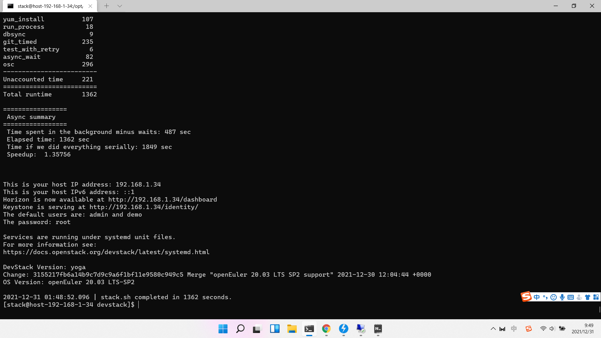

# 使用Devstack安装OpenStack

目前OpenStack原生Devstack项目已经支持在openEuler上安装OpenStack，其中openEuler 20.03 LTS SP2已经过验证，并且有上游官方CI保证质量。其他版本的openEuler需要用户自行测试。

## 安装步骤

准备一个openEuler 20.03 LTS SP2的环境

1. 配置yum源

    openEuler官方源中缺少了一些OpenStack需要的RPM包，因此需要先配上OpenStack SIG在oepkg中准备好的RPM源
    ```
    vi /etc/yum.repos.d/openeuler.repo

    [openstack]
    name=openstack
    baseurl=https://repo.oepkgs.net/openEuler/rpm/openEuler-20.03-LTS-SP2/budding-openeuler/openstack-master-ci/aarch64/
    enabled=1
    gpgcheck=0
    ```

2. 修正yum源（可选）

    在一些版本的openEuler官方镜像的默认源中，EPOL-update的URL可能配置不正确，需要修改

    ```
    vi /etc/yum.repos.d/openEuler.repo

    把[EPOL-UPDATE]URL改成
    baseurl=http://repo.openeuler.org/openEuler-20.03-LTS-SP2/EPOL/update/main/$basearch/
    ```

3. 下载devstack

    ```
    yum update
    yum install git
    cd /opt/
    git clone https://opendev.org/openstack/devstack
    ```

3. 初始化devstack环境配置

    ```
    创建stack用户
    /opt/devstack/tools/create-stack-user.sh
    修改目录权限
    chown -R stack:stack /opt/devstack
    chmod -R 755 /opt/devstack
    chmod -R 755 /opt/stack
    ```

4. 初始化devstack配置文件

    ```
    切换到stack用户
    su stack
    新增配置文件
    vi /opt/devstack/local.conf

    [[local|localrc]]
    DATABASE_PASSWORD=root
    RABBIT_PASSWORD=root
    SERVICE_PASSWORD=root
    ADMIN_PASSWORD=root
    OVN_BUILD_FROM_SOURCE=True
    ```

    这里需要注意，openEuler没有提供OVN的RPM软件包，因此需要配置`OVN_BUILD_FROM_SOURCE=True`, 从源码编译OVN

    另外如果使用的是arm64虚拟机环境，则需要配置libvirt嵌套虚拟化，在`local.conf`中追加如下配置：

    ```
    [[post-config|$NOVA_CONF]]
    [libvirt]
    cpu_mode=custom
    cpu_model=cortex-a72
    ```
    如果安装Ironic，需要提前安装依赖：
    ```bash
    sudo dnf install syslinux-nonlinux
    ```
    
5. 部署OpenStack

    进入devstack目录，执行`./stack.sh`，等待OpenStack完成安装部署。


部署成功的截图展示：


