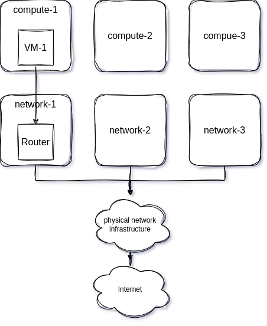
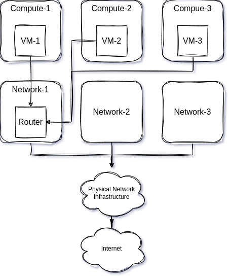
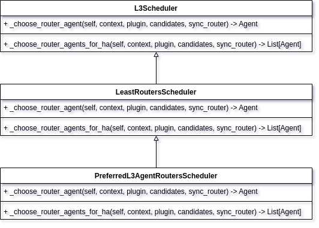
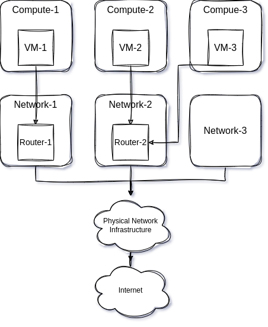

# 流量分散

## 概述

OpenStack为用户提供计算和网络服务。用户创建虚拟机并连接Router可以访问外部网络，同时可以开启浮动IP的端口映射，让外部网络的设备访问虚拟机内部的服务。但于此同时，随着虚拟机和浮动IP
端口映射的数量的增多，网络节点的压力也越来越大，必须找到分散网络节点流量，疏解网络节点压力的方法。本方案实现了在OpenStack环境中将网络节点流量分散，保证兼容支持L3
HA和DVR，同时又将网络资源使用最小化。

## 背景

用户创建虚拟机并连接Router的基本流程如下。

1. 用户提前创建内部网络和外部网络。
2. 创建Router时指定External Gateway为提前创建的外部网络。
3. 将Router和创建好的内部网络进行连接。
4. 创建虚拟机实例时指定内部网络。
5. 利用创建的外部网络创建浮动IP。
6. 为虚拟机实例开启浮动IP端口映射。

经过上面的操作，用户创建的虚拟机实例可以访问到外部网络，外部网络的设备也可以根据浮动IP指定的端口访问虚拟机实例内部的服务。

在一个基本的OpenStack环境中虚拟机实例的流量走向如下所示。



在用户创建完多个实例后，虚拟机实例可能会均匀分布在各个计算节点，虚拟机的流量走向可能如下图所示。



可以看到，不论虚拟机的东西流量还是南北流量都会经过Network-1节点，这无疑加大了网络节点的负载，同时当网络节点发生故障时不能很好的进行故障恢复。
那么是否可以将同一子网绑定多个Router，在OpenStack中同一子网可以绑定多个Router，但是子网在绑定Router时默认会将子网的网关地址绑定到Router上，一个子网只有一个网关地址，同时这个网关地址又会在DHCP服务中用到，用于给虚拟机实例提供下一跳的网关地址，于是乎即使将子网绑定到多个Router上，虚拟机内部下一跳的网关地址还会是子网的网关地址，而且Router选择的网络节点用户是不可控的，难免会出现虽然子网绑定了两个Router，但是这两个Router在同一个网络节点上的尴尬场面。

为了分散流量OpenStack有应对的策略，可以将neutron的DVR功能打开，为预防网络节点的单点故障也可以打开neutron的L3
HA，但是上述方法也有它们的局限性。

DVR的流量分散有比较大的局限性，原因有一下几点。
DVR只是作用于同一Router下不同计算节点的虚拟机实例之间的东西流量，已经绑定浮动IP虚拟机的南北流量，对于未绑定浮动IP的虚拟机访问外部网络依据需要经过网络节点。

生产环境下，给每个虚拟机都绑定浮动IP是不切实际的，但是可以通过开启浮动IP的端口映射，让多台虚拟机对应一个浮动IP，但在目前的OpenStack版本中，不论是否开启DVR，浮动IP的端口映射的实现都是在网络节点的网络命名空间中完成的。
最后一点，DVR模式下，为了让虚拟机的南北流量不经过网络节点，从计算节点上直接走出，都会在每个计算节点上生成一个fip开头的网络命名空间，即使虚拟机不会绑定浮动IP。而这个fip网络命名空间中会占用一个外部网络的IP地址，这无疑会加大网络资源的消耗。

L3 HA也有几点不足，开启L3 HA后，Router利用keepalived会在几个网络节点之间进行选择，只有Keepalived的状态为Master
的网络节点才会担任真正的流量运输的任务，而对于网络节点选择，用户无权干涉。虽然neutron中给出了Router的默认调度策略，也就是最少Router数，Router会调度到Router个数最少的网络节点上。而且在底层keepalived开启的模式是非抢占的，也就是当vip发生漂移后，即使主服务器恢复正常，也不会自动将资源从备用服务器手中抢占回来，这又增加了对于真正运行Router的网络节点的不确定性。

总结一下，现有的技术方案做不到真正的流量分发，即使在开启DVR后，一方面会有一些额外网络资源的损耗，同时又因为Router的网络节点的不确定性，导致虚拟机的南北流量无法做到很好的分发。

## 需要解决的问题

实现DVR模式和L3 HA模式下以及Legacy模式下网络分发。首先要解决以下几个技术问题：

1. Router可以指定网络节点，不论是否开启L3 HA。
2. 同一子网绑定多个Router时，DHCP服务能为不同计算节点的虚拟机提供不同的路由方式。
3. 在用户使用端口映射时，可以将Router的External Gateway的IP地址作为外部网络的地址。

## 实现方案

### 解决指定L3 agent的问题

首先修改Router的底层数据库为其添加一个configurations字段，用于存储Router的相关配置信息，configurations的格式如下所示。

```json
{
  "configurations": {
    "preferred_agent": "network-1"
  }
}
```

在未开启L3 HA时，preferred_agent字段用于指定Router位于的网络节点。
在开启L3 HA时，configurations的格式如下所示。

```json
{
  "configurations": {
    "slave_agents": [
      "compute-1"
    ],
    "master_agent": "network-1"
  }
}
```

master_agent用于指定Master角色的网络节点，slave_agents用于指定Slave角色的网络节点数组。

然后要修改Router的创建逻辑，需要为Router新增一个调度方法。Neutron中router_scheduler_driver默认是LeastRoutersScheduler（最少Router个数的网络节点），继承该类新增调度方法，可以根据Router的configurations字段选择指定的网络节点。



最后需要修改neutron-l3-agent的Router更新的逻辑代码，由于neutron-l3-agent启动时会初始化一个资源队列用于更新资源状态，同时开启一个守护线程用于读取资源队列，每次有网络资源状态有变化（创建、删除或者更新），就会添加到改队列中，最后根据资源的类型和状态确定将要执行的动作。
这里Router创建完后，neutron-l3-agent最后会执行_process_added_router方法，先调用RouterInfo的initialize方法，再调用process方法。
initialize方法主要涉及到Router信息的一些初始话，包括网络命名空间的创建、port的创建、keepalived进程的初始化等等。
process方法中会做下面几个操作。

1. 设置内部的Port，用于连接内部网络；
2. 设置外部Port，用于连接外部网络；
3. 更新路由表；
4. 对于开启L3 HA的Router，需要设置HA的Port，然后开启keepalived进程。
5. 对于开启DVR的Router，还需要设置一下fip命名空间中的Port。

这里只需要考虑L3 HA开启的情况，因为在未开启L3
HA时，neutron-server创建完Router后，经过新的调度方法选择特定的网络节点，RPC调用直接发送给特定网络节点的neutron-l3-agent服务。开启L3
HA时，调度方法会选择出master和slave网络节点，并且RPC调用会发送给这些网络节点上的neutron-l3-agent服务。
neutron-l3-agent会为每个Router启动一个keepalived进程用于L3
HA，所以需要在keepalived初始化时，将keepalived启动逻辑修改。利用configurations字段的信息，获取master和slave网络节点，同时和当前网络节点的信息判断，确定网络节点的角色。最后，因为指定了master和slave节点，避免出现master网络节点宕机恢复后，vip依旧在slave节点的情况，要把keepalived的模式改为抢占模式。

### 解决路由问题

解决同一子网绑定多个Router后，虚拟机实例的路由问题。DHCP协议功能不仅包括和DNS服务器分配还包括网关地址分配，也就是可以通过DHCP协议将路由信息传给虚拟机实例。在OpenStack中，虚拟机实例的DHCP由neutron-dhcp-agent提供，neutron-dhcp-agent的核心功能基本由dnsmasq完成。

dnsmasq中提供tag标签，可以为指定IP地址添加标签，然后可以根据标签下发配置。
dnsmasq的host配置文件如下所示。

```bash
fa:16:3e:28:a5:0a,host-172-16-0-1.openstacklocal,172.16.0.1,set:subnet-6a4db541-e563-43ff-891b-aa8c05c988c5
fa:16:3e:2b:dd:88,host-172-16-0-10.openstacklocal,172.16.0.10,set:subnet-6a4db541-e563-43ff-891b-aa8c05c988c5
fa:16:3e:a1:96:fc,host-172-16-0-207.openstacklocal,172.16.0.207,set:compute-1-subnet-6a4db541-e563-43ff-891b-aa8c05c988c5
fa:16:3e:45:b4:1a,host-172-16-10-1.openstacklocal,172.16.10.1,set:subnet-faeec4d1-2c0c-4f7a-bc9b-0af562694902
```

dnsmasq的option配置文件如下所示。

```bash
tag:subnet-faeec4d1-2c0c-4f7a-bc9b-0af562694902,option:dns-server,8.8.8.8
tag:subnet-faeec4d1-2c0c-4f7a-bc9b-0af562694902,option:classless-static-route,172.16.0.0/24,0.0.0.0,169.254.169.254/32,172.16.0.2,0.0.0.0/0,172.16.0.1
tag:subnet-faeec4d1-2c0c-4f7a-bc9b-0af562694902,249,172.16.0.0/24,0.0.0.0,169.254.169.254/32,172.16.0.2,0.0.0.0/0,172.16.0.1
tag:subnet-faeec4d1-2c0c-4f7a-bc9b-0af562694902,option:router,172.16.0.1
tag:compute-1-subnet-6a4db541-e563-43ff-891b-aa8c05c988c5,option:classless-static-route,172.16.10.0/24,0.0.0.0,169.254.169.254/32,172.16.0.2,0.0.0.0/0,172.16.0.10
tag:compute-1-subnet-6a4db541-e563-43ff-891b-aa8c05c988c5,249,172.16.0.0/24,0.0.0.0,169.254.169.254/32,172.16.0.2,0.0.0.0/0,172.16.0.10
tag:compute-1-subnet-6a4db541-e563-43ff-891b-aa8c05c988c5,option:router,172.16.0.10
```

可以看到IP172.16.0.207被打上了compute-1开头的tag，匹配到option文件后，172.16.0.207的虚拟机的默认路由网关地址就会从172.16.0.1变为172.16.0.10。当然这一切的前提子网需要绑定多个Router。
同时为neutron-dhcp-agent提供可供管理员修改的配置项，用于指定计算节点和网络节点的关系，可以是一对一，可以是多对一。

### 解决Router Gateway端口转发的问题

将原本基于浮动IP的端口映射改为基于Router的External Gateway的方式。原因有二：

1. 基于浮动IP的端口映射，对于原本就要使用Router的External Gateway的用户就会多占用一个外部网络的IP，为减少外部网络IP的使用改用External
   Gateway的方式进行端口映射。
2. 基于浮动IP的端口映射，依赖Router的网络命名空间来做NAT，不开启L3
   HA时，同一子网在绑定多个Router后，由于端口映射创建的逻辑，NAT会发生在子网网关地址所在的Router的网络命名空间中（特定的网络节点），不会分散在各个Router的网络命名空间中（每个网络节点）。这样在端口映射时，会增加网络节点的压力。
   实现方式和基于浮动IP的端口映射类似，与之不同的是External Gateway不需要选择Router，因为External
   Gateway本来和Router就是相关联的。基于浮动IP的端口映射在选择Router时，选择的是子网的网关地址所在的Router。

最后，在实现上面三个部分后，用户实现流量分散的步骤如下。

1. 用户修改neutron-dhcp-agent的配置文件，修改计算节点和网络节点的映射关系。例如三个网络节点、三个计算节点，配置compute-1走network-1节点，compute-2和compute-3走network-2节点。
2. 利用neutron的API创建多个Router并指定网络节点，并将Router绑定到同一子网。
3. 利用子网网络创建多个虚拟机实例。

虚拟机实例的网络流量的流向如下图所示。



可以看到，VM-1访问外部网络经过的是network-1节点，VM-2和VM-3访问外部网络经过的是network-2节点。同时VM-1、VM-2和VM-3又是在同一个子网下，可以互相访问。

# API

## 查看路由器网关端口转发列表

```text
GET /v2.0/routers/{router_id}/gateway_port_forwardings

Response
{
  "gateway_port_forwardings": [
    {
      "id": "67a70b09-f9e7-441e-bd49-7177fe70bb47",
      "external_port": 34203,
      "protocol": "tcp",
      "internal_port_id": "b671c61a-95c3-49cd-89f2-b7e817d1f486",
      "internal_ip_address": "172.16.0.196",
      "internal_port": 518,
      "gw_ip_address": "192.168.57.234"
    }
  ]
}
```

## 查看路由器网关端口转发

```text
GET /v2.0/routers/{router_id}/gateway_port_forwardings/{port_forwarding_id}

Response
{
  "gateway_port_forwarding": {
    "id": "67a70b09-f9e7-441e-bd49-7177fe70bb47",
    "external_port": 34203,
    "protocol": "tcp",
    "internal_port_id": "b671c61a-95c3-49cd-89f2-b7e817d1f486",
    "internal_ip_address": "172.16.0.196",
    "internal_port": 518,
    "gw_ip_address": "192.168.57.234"
  }
}
```

## 创建路由器网关端口转发

```text
POST /v2.0/routers/{router_id}/gateway_port_forwardings
Request Body
{
  "gateway_port_forwarding": {
    "external_port": int,
    "internal_port": int,
    "internal_ip_address": "string",
    "protocol": "tcp",
    "internal_port_id": "string"
  }
}

Response
{
  "gateway_port_forwarding": {
    "id": "da554833-b756-4626-9900-6256c361f94b",
    "external_port": 14122,
    "protocol": "tcp",
    "internal_port_id": "b671c61a-95c3-49cd-89f2-b7e817d1f486",
    "internal_ip_address": "172.16.0.196",
    "internal_port": 3634,
    "gw_ip_address": "192.168.57.234"
  }
}
```

## 更新路由器网关端口转发

```text
PUT /v2.0/routers/{router_id}/gateway_port_forwardings/{port_forwarding_id}
Request Body
{
  "gateway_port_forwarding": {
    "external_port": int,
    "internal_port": int,
    "internal_ip_address": "string",
    "protocol": "tcp",
    "internal_port_id": "string"
  }
}

Response
{
  "gateway_port_forwarding": {
    "id": "da554833-b756-4626-9900-6256c361f94b",
    "external_port": 14122,
    "protocol": "tcp",
    "internal_port_id": "b671c61a-95c3-49cd-89f2-b7e817d1f486",
    "internal_ip_address": "172.16.0.196",
    "internal_port": 3634,
    "gw_ip_address": "192.168.57.234"
  }
}
```

## 删除路由器网关端口转发

```text
DELETE /v2.0/routers/{router_id}/gateway_port_forwardings/{port_forwarding_id}
```

## 新建路由器

```text
POST /v2.0/routers
Request Body
{
    "router": {
        "name": "string",
        "admin_state_up": true,
        "configurations": {
            "preferred_agent": "string",
            "master_agent": "string",
            "slave_agents": [
                "string"
            ]
        }
    }
}
```

## 更新路由器

```text
PUT /v2.0/routers/{router_id}
Request Body
{
  "router": {
    "name": "string",
    "admin_state_up": true,
    "configurations": {
      "preferred_agent": "string",
      "master_agent": "control01",
      "slave_agents": [
        "control01"
      ]
    }
  }
}
```

# 开发节奏

开发者：

* 王坤田<wangkuntian@uniontech.com>
* 韩光宇<hanguangyu@uniontech.com>

时间点：

* 2023-07-28到2022-08-30 完成开发
* 2023-07-28到2022-08-30 完成开发
* 2023-11-30引入openEuler 20.03 LTS SP4版本
* 2023-12-30引入openEuler 22.03 LTS SP3版本