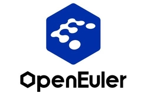

版权所有 © 2021  openEuler社区
 您对“本文档”的复制、使用、修改及分发受知识共享(Creative Commons)署名—相同方式共享4.0国际公共许可协议(以下简称“CC BY-SA 4.0”)的约束。为了方便用户理解，您可以通过访问[https://creativecommons.org/licenses/by-sa/4.0/](https://creativecommons.org/licenses/by-sa/4.0/)了解CC BY-SA 4.0的概要 (但不是替代)。CC BY-SA 4.0的完整协议内容您可以访问如下网址获取：[https://creativecommons.org/licenses/by-sa/4.0/legalcode。](https://creativecommons.org/licenses/by-sa/4.0/legalcode。)

修订记录

|日期|修订版本|修改描述|作者|
|:----|:----|:----|:----|
|2021-12-10|1|初稿及同步Train版本测试情况|黄填华|
|    |    |    |   |
|    |    |    |    |

关键词：

OpenStack

摘要：

在openEuler 20.03 LTS SP3版本中提供OpenStack Queens、Rocky、Train版本的RPM安装包。方便用户快速部署OpenStack。

缩略语清单：

|缩略语|英文全名|中文解释|
|:----|:----|:----|
|CLI|Command Line Interface|命令行工具|
|ECS|Elastic Cloud Server|弹性云服务器|

# 1 特性概述

在openEuler 20.03 LTS SP2 release中提供OpenStack Queens、Rocky RPM安装包支持，包括项目：Keystone、Glance、Nova、Neutron、Cinder、Ironic、Trove、Kolla、Horizon、Tempest以及每个项目配套的CLI。
openEuler 20.03 LTS SP3 release增加了OpenStack Train版本RPM安装包支持，包括项目：Keystone、Glance、Placement、Nova、Neutron、Cinder、Ironic、Trove、Kolla、Heat、Aodh、Ceilometer、Gnocchi、Swift、Horizon、Tempest以及每个项目配套的CLI。

# 2 特性测试信息

本节描述被测对象的版本信息和测试的时间及测试轮次，包括依赖的硬件。

|版本名称|测试起始时间|测试结束时间|
|:----|:----|:----|
|openEuler 20.03 LTS SP3 RC1 （OpenStack Train版本各组件的安装部署测试）|2021.11.25|2021.11.30|
|openEuler 20.03 LTS SP3 RC1 （OpenStack Train版本基本功能测试，包括虚拟机，卷，网络相关资源的增删改查）|2021.12.1|2021.12.2|
|openEuler 20.03 LTS SP3 RC2 （OpenStack Train版本tempest集成测试）|2021.12.3|2021.12.9|
|openEuler 20.03 LTS SP3 RC3 （OpenStack Train版本问题回归测试）|2021.12.10|2021.12.12|
|openEuler 20.03 LTS SP3 RC3 （OpenStack Queens&Rocky版本各组件的安装部署测试）|2021.12.10|2021.12.13|
|openEuler 20.03 LTS SP3 RC3 （OpenStack Queens&Rocky版本基本功能测试，包括虚拟机，卷，网络相关资源的增删改查）|2021.12.14|2021.12.16|
|openEuler 20.03 LTS SP3 RC4 （OpenStack Queens&Rocky版本tempest集成测试）|2021.12.17|2021.12.20|
|openEuler 20.03 LTS SP3 RC4 （OpenStack Queens&Rocky版本问题回归测试）|2021.12.21|2021.12.23|

描述特性测试的硬件环境信息

|硬件型号|硬件配置信息|备注|
|:----|:----|:----|
|华为云ECS|Intel Cascade Lake 3.0GHz 8U16G|华为云x86虚拟机|
|华为云ECS|Huawei Kunpeng 920 2.6GHz 8U16G|华为云arm64虚拟机|
|TaiShan 200-2280|Kunpeng 920,48 Core@2.6GHz*2; 256GB DDR4 RAM|ARM架构服务器|

# 3 测试结论概述

## 3.1 测试整体结论

OpenStack Queens版本，共计执行Tempest用例1164个，主要覆盖了API测试和功能测试，Skip用例52个（全是openStack Queens版中已废弃的功能或接口，如Keystone V1、Cinder V1等），失败用例3个（测试用例本身问题），其他1109个用例全部通过，发现问题已解决，回归通过，无遗留风险，整体质量良好。

OpenStack Rocky版本，共计执行Tempest用例1197个，主要覆盖了API测试和功能测试，Skip用例101个（全是openStack Rocky版中已废弃的功能或接口，如KeystoneV1、Cinder V1等），其他1096个用例全部通过，发现问题已解决，回归通过，无遗留风险，整体质量良好。

OpenStack Train版本除了Cyborg（Cyborg安装部署正常，功能不可用）各组件基本功能正常，共计执行Tempest用例1179个，主要覆盖了API测试和功能测试，Skip用例115个（包括已废弃的功能或接口，如Keystone V1、Cinder V1等，包括一些复杂功能，比如文件注入，虚拟机配置等），其他1064个用例全部通过，共计发现问题14个（包括libvirt 1个问题），均已解决，回归通过，无遗留风险，整体质量良好。

|测试活动|tempest集成测试|
|:----|:----|
|接口测试|API全覆盖|
|功能测试|Queens版本覆盖Tempest所有相关测试用例1164个，其中Skip 52个，Fail 3个，其他全通过。|
|功能测试|Rocky版本覆盖Tempest所有相关测试用例1197个，其中Skip 101个，其他全通过。|
|功能测试|Train版本覆盖Tempest所有相关测试用例1179个，其中Skip 115个，其他全通过。|

|测试活动|功能测试|
|:----|:----|
|功能测试|虚拟机（KVM、Qemu)、存储（lvm）、网络资源（linuxbridge）管理操作正常|

## 3.2   约束说明

本次测试没有覆盖OpenStack Queens、Rocky版中明确废弃的功能和接口，因此不能保证已废弃的功能和接口（前文提到的Skip的用例）在openEuler 20.03 LTS SP3上能正常使用，另外Cyborg功能不可用。

## 3.3   遗留问题分析

### 3.3.1 Queens&Rocky遗留问题影响以及规避措施

|问题单号|问题描述|问题级别|问题影响和规避措施|当前状态|
|:----|:----|:----|:----|:----|
|1|targetcli软件包与python2-rtslib-fb包冲突，无法安装|中|使用tgtadm代替lioadm命令|解决中|
|2|python2-flake8软件包依赖低版本的pyflakes，导致yum update命令报出警告|低|使用yum update --nobest命令升级软件包|解决中|

### 3.3.2 Train版本问题统计

|    |问题总数|严重|主要|次要|不重要|
|:----|:----|:----|:----|:----|:----|
|数目|14|1|6|7|    |
|百分比|100|7.1|42.9|50|    |

# 4 测试执行

## 4.1 测试执行统计数据

*本节内容根据测试用例及实际执行情况进行特性整体测试的统计，可根据第二章的测试轮次分开进行统计说明。*

|版本名称|测试用例数|用例执行结果|发现问题单数|
|:----|:----|:----|:----|
|openEuler 20.03 LTS SP3 OpenStack Queens|1164|通过1109个，skip 52个，Fail 3个|0|
|openEuler 20.03 LTS SP3 OpenStack Rocky|1197|通过1096个，skip 101个|0|
|openEuler 20.03 LTS SP3 OpenStack Train|1179|通过1064个，skip 115个|14|

## 4.2 后续测试建议

1. 涵盖主要的性能测试
2. 覆盖更多的driver/plugin测试

# 5 附件

*N/A*
